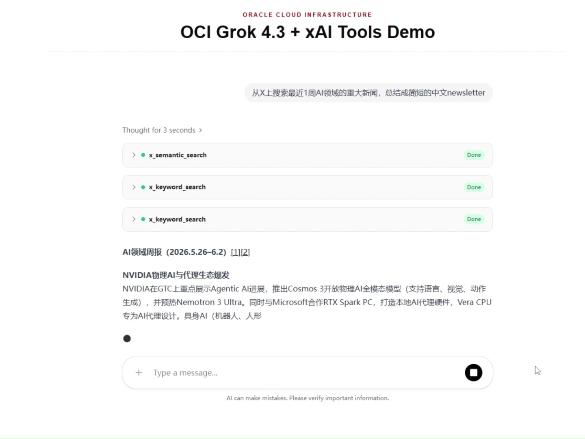

# OCI xAI Tools Demo

This project shows how to run xAI tool capabilities on OCI Generative AI, with a focus on `x_search`: letting the model search public X content while answering questions, understand recent discussions, follow specific accounts, inspect activity within a date range, and analyze posts that contain images or videos.

This repository wraps those capabilities in a runnable web demo and also includes a notebook for trying the API directly.

这个项目演示如何在 OCI Generative AI 上运行 xAI 工具能力，重点展示 `x_search`：让模型在回答问题时搜索 X 上的公开内容，理解近期讨论、指定账号动态、时间范围内的事件变化，以及带图片或视频的帖子内容。

本项目把这些能力做成一个可以直接运行的 Web demo，并提供一个 notebook 方便从 API 层面单独试用。

阅读官方文档 / Read these official documents:

- [xAI X Search documentation](https://docs.x.ai/developers/tools/x-search)
- [OCI Generative AI QuickStart: xAI X Search](https://docs.oracle.com/en-us/iaas/Content/generative-ai/get-started-agents.htm#xai-x-search)

## Why x_search is useful

The core value of `x_search` is turning fast-moving public conversations on X into a source that can be queried, summarized, and tracked. 

Instead of relying only on the model's existing knowledge, it can search recent posts, specific handles, related threads, and content within a date range, making it better suited for questions like "what happened recently," "how is this topic evolving," or "which points are being repeated."

It also provides practical controls over search scope: include specific handles, exclude specific handles, restrict date ranges, and enable image or video understanding when needed.

`x_search` 的核心价值，是把 X 上快速变化的公开讨论变成可提问、可总结、可追踪的信息来源。

相比只依赖模型已有知识，它可以在回答时检索近期帖子、指定账号、相关线程和限定时间范围内的内容，更适合处理“最近发生了什么”“某个话题正在如何演变”“哪些观点正在被反复提到”这类问题。

它还提供较强的搜索边界控制：可以只关注指定账号、排除指定账号、限定日期范围，并在需要时开启图片或视频理解。


## Business Scenarios

| 场景 / Scenario | 可以做什么 / What it helps with |
| --- | --- |
| 行业动态跟踪 / Industry pulse tracking | 围绕一个技术、产品、事件或政策主题，快速总结 X 上最近的讨论重点、主要观点、争议点和变化趋势。<br>Summarize recent discussion around a technology, product, event, or policy topic, including main themes, viewpoints, disagreements, and trend changes. |
| 品牌、产品或社区反馈观察 / Brand, product, or community feedback monitoring | 查看官方账号、生态伙伴、竞品账号或关键意见账号的近期帖子，发现用户关注点、常见问题、功能反馈和潜在舆情风险。<br>Inspect recent posts from official accounts, ecosystem partners, competing products, or key opinion accounts to identify user concerns, common questions, feature feedback, and emerging reputation risks. |
| 事件和发布节奏复盘 / Event and launch review | 用 `from_date` 和 `to_date` 限定发布会、故障、公告、监管事件或营销活动前后的时间窗口，比较不同阶段讨论内容的变化。<br>Use `from_date` and `to_date` to focus on the period around a launch, incident, announcement, regulatory event, or campaign, then compare how the discussion changed across stages. |
| 研究和内容准备 / Research and content preparation | 在写简报、博客、演讲或内部分析前，先让模型从公开 X 内容中提取最新事实线索、常见表达方式、代表性问题和可进一步验证的方向。<br>Before writing a brief, blog post, talk, or internal analysis, let the model extract recent public signals, common language, representative questions, and directions that need further validation. |


## Demo Video

[](docs/video/x_search_on_OCI_demo.mp4)


## Before You Start

你需要一个可用的 OCI Generative AI 环境，并准备可调用 Responses API 的 endpoint 和 API key。

You need a working OCI Generative AI environment and access permissions for OCI Generative AI resources. Prepare the Responses API endpoint and API key.

## Quickstart

复制环境变量模板 / Copy the environment template:

```shell
cp .env.example .env
```

编辑 `.env`，填入 endpoint 和 API key。默认模型是 `xai.grok-4.3`，如果你的 OCI 环境可用模型不同，可以调整 `AGENT_MODEL_ID`。

Edit `.env` and fill in your endpoint and API key. The default model is `xai.grok-4.3`; if your OCI environment exposes a different model, update `AGENT_MODEL_ID`.

启动后端服务 / Start the backend service:

```shell
cd ./agent
uv run app.py
```

启动前端应用 / Start the frontend application:

```shell
cd ./frontend
pnpm start
```

打开前端开发服务器输出的本地地址，通常是 `http://localhost:3000`，就可以直接开始提问。

Open the local URL printed by the frontend dev server, usually `http://localhost:3000`, you can start asking questions.

## Try x_search

可以从这些问题开始：

Try prompts like these:

- `Summarize the latest discussion about AI models on X.`
- `Give me a short summary of the last 3 posts by @elonmusk.`
- `What are people saying about OpenAI's latest models this week?`
- `Find recent X posts about AI agents and summarize the main themes.`

## Basic Usage Notebook

开发者可以从 [`dev/oci_xai_tools.ipynb`](dev/oci_xai_tools.ipynb) 开始，直接体验 `x_search` 和 `code_interpreter` 的 OpenAI-compatible API 调用方式。

Developers can start with [`dev/oci_xai_tools.ipynb`](dev/oci_xai_tools.ipynb) to try OpenAI-compatible API calls for `x_search` and `code_interpreter`.
